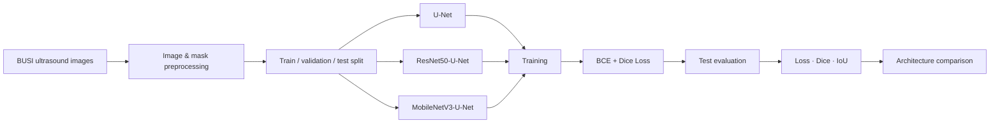

# Breast Ultrasound Tumor Segmentation


A deep learning project for **semantic segmentation of breast tumors in ultrasound images**, comparing a baseline U-Net with U-Net variants that use **ResNet50** and **MobileNetV3Large** encoders.

> **Medical disclaimer:** This project is for educational and research purposes only. It is not a clinical diagnostic system and must not be used for medical decision-making.

## Highlights

- Semantic segmentation on the **BUSI breast ultrasound dataset**
- Comparison of **U-Net**, **ResNet50-U-Net** and **MobileNetV3-U-Net**
- Custom **Dice coefficient** and **IoU** metrics
- Combined **0.3 × BCE + 0.7 × Dice Loss** objective
- Best test result: **ResNet50-U-Net — Dice = 0.6910, IoU = 0.5383**

## Deep Learning Workflow



## Dataset

The notebook uses the **Breast Ultrasound Images Dataset (BUSI)** from Kaggle and processes the `benign` and `malignant` classes with their segmentation masks.

Current split configuration:

- Test split: 15% of the complete processed set
- Validation split: 15% of the remaining training portion
- Random seed: 42

Input configuration:

- U-Net / ResNet50-U-Net: 256 × 256
- MobileNetV3-U-Net: 224 × 224
- Batch size: 8

## Tech Stack

| Area | Tools |
|---|---|
| Language | Python |
| Deep Learning | TensorFlow, Keras |
| Architectures | U-Net, ResNet50, MobileNetV3Large |
| Image Processing | OpenCV |
| Numerical Computing | NumPy |
| Visualization | Matplotlib |
| Data Splitting | Scikit-learn |
| Environment | Kaggle, Jupyter Notebook |

## Loss and Metrics

Training uses:

```text
Loss = 0.3 × Binary Cross-Entropy + 0.7 × Dice Loss
```

Evaluation metrics:

- Loss
- Dice Coefficient
- Intersection over Union (IoU)

## Test Results

| Model | Loss | Dice | IoU |
|---|---:|---:|---:|
| U-Net | 0.4602 | 0.6798 | 0.5215 |
| **ResNet50-U-Net** | **0.2736** | **0.6910** | **0.5383** |
| MobileNetV3-U-Net | 0.4137 | 0.4886 | 0.3264 |

**ResNet50-U-Net achieved the best test performance** among the three evaluated architectures, with the highest Dice and IoU and the lowest test loss.

Machine-readable results are stored in [`results/test_metrics.json`](results/test_metrics.json).

## Repository Structure

```text
breast-ultrasound-tumor-segmentation/
├── notebooks/
│   └── breast_ultrasound_tumor_segmentation.ipynb
├── results/
│   └── test_metrics.json
├── README.md
├── requirements.txt
└── .gitignore
```

## Setup

Clone the repository and create a virtual environment:

```bash
git clone https://github.com/tdk1522005/Breast-Tumor-Segmentation-in-Ultrasound-Images-Using-U-Net-with-ResNet50-and-MobileNetV3-Backbones.git
cd Breast-Tumor-Segmentation-in-Ultrasound-Images-Using-U-Net-with-ResNet50-and-MobileNetV3-Backbones
python -m venv .venv
```

Windows:

```bash
.venv\Scripts\activate
```

macOS/Linux:

```bash
source .venv/bin/activate
```

Install dependencies:

```bash
pip install -r requirements.txt
```

Download the BUSI dataset from Kaggle and update the dataset path in the notebook if you are running outside Kaggle.

Run the notebook:

```bash
jupyter notebook notebooks/breast_ultrasound_tumor_segmentation.ipynb
```

## What This Project Demonstrates

- Medical image and mask preprocessing
- Semantic segmentation with U-Net
- Encoder-backbone comparison
- Transfer learning with ResNet50 and MobileNetV3
- Custom segmentation metrics
- Combined BCE + Dice loss
- Training-history visualization
- Quantitative architecture comparison

## Current Limitations

- The workflow is still primarily notebook-based.
- Results are based on the current split and training configuration.
- The current experiment focuses on benign and malignant samples from BUSI.
- No external clinical validation is included.

## Roadmap

- Refactor model, preprocessing and evaluation logic into `src/`.
- Add qualitative prediction examples: input image, ground-truth mask and predicted mask.
- Add experiment configuration files and reproducibility controls.
- Evaluate stability with repeated experiments or cross-validation.
- Compare inference speed and computational cost across backbones.

## Author

**Ta Duy Khanh**  
AI Engineering student — Machine Learning, Deep Learning & Natural Language Processing
